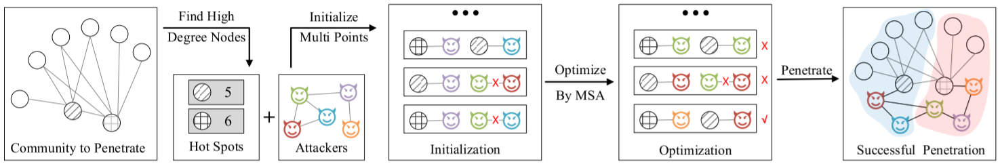

# Safeness-Based Community Penetration
> This repository is for "[Safeness-Based Community Penetration](https://ieeexplore.ieee.org/abstract/document/9367294)" in IEEE Transactions on Circuits and Systems II Express Briefs 2021, including implementation code and experiment in Python 3.
## Abstract
Automatic community divisions often facilitate the convenience of rich community applications such as interest group recommendations. However, it faces a serious community security issue referred to as community penetration (CommPen) such that the colluding attackers might very smartly deceive the community detection mechanism and infiltrate into one or more social communities to disclose the community privacy by perturbating a budget limited social links. From the attacker perspective, the CommPen aims to maximally disperse a group of colluding users into other communities escaping the detections with low cost, which is very challenging in problem formulation, attack model building, and optimal solution. In this brief, we first introduce the CommPen problem against community detection, which has not been extensively focused on so far. Secondly, we formalize the CommPen as an optimization problem, which is a combination explosion problem. Thirdly, an efficient algorithm based on multi simulated annealing (MSA) is proposed to solve this problem by rewiring a small number of connections, leading to privacy protection. Finally, community penetration on realworld networks is conducted in experiments, which shows that our proposed method outperforms baselines, including Random Selection, Greedy Search, and Genetic Algorithm.

